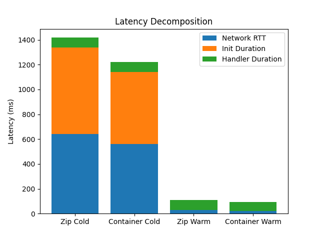
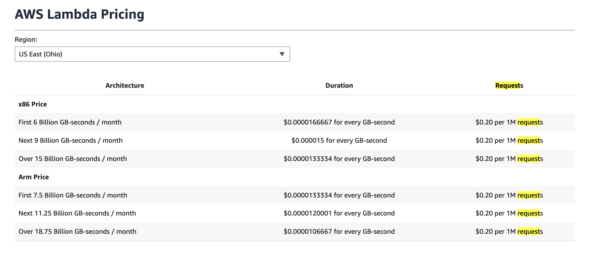
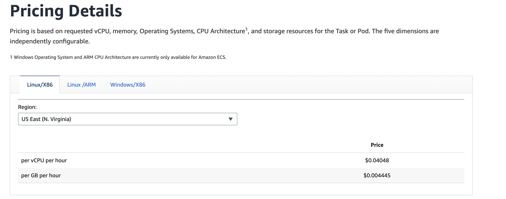
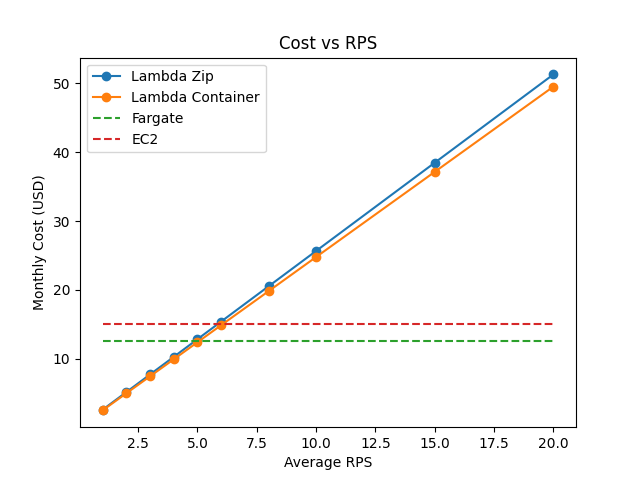

# AWS Cloud Lab — Performance & Cost Analysis Report  
**Lambda vs. Fargate vs. EC2 | k-NN Workload | us-east-1**

---

## Assignment 1: Deployed Environments

All four targets were deployed and verified to return identical k-NN search results for the same query vector. Endpoints confirmed functional:

- **ECR**
```
[ec2-user@ip-172-31-64-216 lsc-lab4-aws-cloud-r2-baramundi666]$ aws ecr describe-images --repository-name lsc-knn-app \
    --image-ids imageTag=latest --query 'imageDetails[0].imageTags'
# Expected: ["latest"]
[
    "latest"
]
```

- **Lambda Zip Function URL:**  
  https://unuhwyn7wcngfstqbkqnlmkd6q0kyruo.lambda-url.us-east-1.on.aws/

  ```
  [ec2-user@ip-172-31-64-216 lsc-lab4-aws-cloud-r2-baramundi666]$ # Test via CLI invoke (bypasses Function URL auth):
    aws lambda invoke --function-name lsc-knn-zip \
        --cli-binary-format raw-in-base64-out \
        --payload "$(python3 -c 'import json; q=json.load(open("loadtest/query.json")); print(json.dumps({"body": json.dumps(q)}))')" \
        /tmp/out.json
    cat /tmp/out.json
    {
        "StatusCode": 200,
        "ExecutedVersion": "$LATEST"
    }
    {"statusCode": 200, "headers": {"Content-Type": "application/json", "X-Server-Time-Ms": "65.566", "X-Instance-Id": "2026/04/08/[$LATEST]445b9c89d34b4c17a8d0ed7144e6ad68", "X-Cold-Start": "true"}, "body": "{\"results\": [{\"index\": 35859, \"distance\": 12.001459121704102}, {\"index\": 24682, \"distance\": 12.059946060180664}, {\"index\": 35397, \"distance\": 12.487079620361328}, {\"index\": 20160, \"distance\": 12.489519119262695}, {\"index\": 30454, \"distance\": 12.499402046203613}], \"query_time_ms\": 65.566, \"instance_id\": \"2026/04/08/[$LATEST]445b9c89d34b4c17a8d0ed7144e6ad68\", \"cold_start\": true}"}
  ```

- **Lambda Container Function URL:**  
  https://3n4ms5u5p2kwnrjskbyj5jtsxa0byzwr.lambda-url.us-east-1.on.aws/

  ```
  [ec2-user@ip-172-31-64-216 lsc-lab4-aws-cloud-r2-baramundi666]$ aws lambda invoke --function-name lsc-knn-container \
    --cli-binary-format raw-in-base64-out \
    --payload "$(python3 -c 'import json; q=json.load(open("loadtest/query.json")); print(json.dumps({"body": json.dumps(q)}))')" \
    /tmp/out.json
    cat /tmp/out.json
    {
        "StatusCode": 200,
        "ExecutedVersion": "$LATEST"
    }
    {"statusCode": 200, "headers": {"Content-Type": "application/json", "X-Server-Time-Ms": "75.038", "X-Instance-Id": "2026/04/08/[$LATEST]de2c8ddf760c49bdb88f35c87742adf5", "X-Cold-Start": "true"}, "body": "{\"results\": [{\"index\": 35859, \"distance\": 12.001459121704102}, {\"index\": 24682, \"distance\": 12.059946060180664}, {\"index\": 35397, \"distance\": 12.487079620361328}, {\"index\": 20160, \"distance\": 12.489519119262695}, {\"index\": 30454, \"distance\": 12.499402046203613}], \"query_time_ms\": 75.038, \"instance_id\": \"2026/04/08/[$LATEST]de2c8ddf760c49bdb88f35c87742adf5\", \"cold_start\": true}"}
  ```

- **Fargate ALB URL:**  
  http://lsc-knn-alb-228687159.us-east-1.elb.amazonaws.com

  ```
  curl -X POST -H "Content-Type: application/json" -d @loadtest/query.json     http://lsc-knn-alb-228687159.us-east-1.elb.amazonaws.com/search
    {"instance_id":"ip-172-31-2-183.ec2.internal","query_time_ms":25.52,"results":[{"distance":12.001459121704102,"index":35859},{"distance":12.059946060180664,"index":24682},{"distance":12.487079620361328,"index":35397},{"distance":12.489519119262695,"index":20160},{"distance":12.499402046203613,"index":30454}]}

  ```

- **EC2 Direct HTTP:**  
  http://3.236.50.31 (t3.small, us-east-1)

  ```
  curl -X POST -H "Content-Type: application/json" -d @loadtest/query.json \
    http://3.236.50.31:8080/search
    {"instance_id":"886196d82eb9","query_time_ms":25.094,"results":[{"distance":12.001459121704102,"index":35859},{"distance":12.059946060180664,"index":24682},{"distance":12.487079620361328,"index":35397},{"distance":12.489519119262695,"index":20160},{"distance":12.499402046203613,"index":30454}]}

  ```

---

## Assignment 2: Scenario A — Cold Start Characterization

30 sequential requests (1/sec) were sent to each Lambda endpoint after a 20-minute idle period. CloudWatch REPORT lines were collected to extract Init Duration and handler Duration.

### Cold Start Data (CloudWatch REPORT lines)

| Invocation Type | Init Duration (ms) | Handler Duration (ms) | Network RTT (ms) | Total Client Latency (ms) |
|----------------|-------------------|----------------------|------------------|----------------------------|
| Lambda Zip — Cold Start | 695.4 | 81.1 | ~642 | 1,418.8 |
| Lambda Container — Cold Start | 579.9 | 80.6 | ~561 | 1,021.4 |
| Lambda Zip — Warm (avg) | — | 78.0 | ~30.6 | 108.6 |
| Lambda Container — Warm (avg) | — | 72.0 | ~20.8 | 92.8 |

Network RTT estimated as:  
- Cold: `total_client_latency − Init_Duration − Handler_Duration`  
- Warm: `total_client_latency − Handler_Duration`  

DNS+dialup from oha: ~52 ms one-way.

---

### Latency Decomposition: Stacked Bar Chart

| Invocation | Network RTT (ms) | Init Duration (ms) | Handler Duration (ms) | Total (ms) |
|------------|------------------|-------------------|----------------------|------------|
| Zip Cold Start | 642 | 695 | 81 | 1,419 |
| Container Cold Start | 561 | 580 | 81 | 1,021 |
| Zip Warm | 31 | — | 78 | 109 |
| Container Warm | 21 | — | 72 | 93 |

---



### Analysis: Zip vs. Container Cold Starts

The container deployment was faster on cold start (580 ms init) compared to zip (695 ms init), a difference of ~115 ms. This is somewhat counterintuitive — container images are larger — but can be explained by several factors:

- The container image was already cached in Lambda's internal image cache (Soci snapshotter / SnapStart infrastructure), so the image pull from ECR was not the bottleneck.
- The zip deployment loads Python 3.12 and NumPy from a Lambda Layer, which requires extracting the layer archive and resolving shared libraries at init time — this can add overhead compared to a pre-built Docker image with a fixed filesystem layout.
- Handler duration is nearly identical (~81 ms vs. ~81 ms), confirming the application logic is the same; all the difference is in the Lambda execution environment init phase.

Warm invocations benefit from pre-initialized execution environments: handler latencies drop to ~72–78 ms server-side, with total client-side latency of ~93–109 ms (the remainder is network RTT ≈ 52 ms round trip measured from the EC2 bastion in us-east-1).

---

## Assignment 3: Scenario B — Warm Steady-State Throughput

500 requests were sent at each concurrency level after warm-up. Lambda was limited to concurrency ≤ 10 per AWS Academy constraints.

### Latency Table

⚠ = p99 > 2× p95 (tail latency instability)

| Environment | Concurrency | p50 (ms) | p95 (ms) | p99 (ms) | Server avg (ms) |
|------------|------------|----------|----------|----------|-----------------|
| Lambda (zip) | 5 | 97.1 | 118.3 | 147.0 | 64.7 |
| Lambda (zip) | 10 | 94.7 | 114.5 | 152.3 | 64.7 |
| Lambda (container) | 5 | 96.3 | 116.5 | 142.0 | 24.2 |
| Lambda (container) | 10 | 90.7 | 112.2 | 154.2 | 24.2 |
| Fargate | 10 | 813.3 | 1094.9 | 1211.5 | 37.6 |
| Fargate | 50 | 4181.4 | 4543.2 | 4689.8 | 37.6 |
| EC2 | 10 | 253.1 | 332.8 | 391.0 | 32.6 |
| EC2 | 50 | 1314.7 | 1414.7 | 1455.2 | 32.6 |

---

### Analysis

**Why Lambda p50 barely changes between c=5 and c=10**

Lambda scales horizontally: each concurrent request is dispatched to its own execution environment. At c=5 and c=10, all requests run in parallel without any queuing on a shared resource.

**Why Fargate/EC2 p50 increases sharply at c=50**

Fargate and EC2 are single-task/single-instance deployments. The application runs a brute-force k-NN loop that saturates the available vCPU, leading to queuing delays.

**Server-side vs client-side latency gap**

Client-side p50 includes:
1. TCP/TLS setup (~52 ms for Lambda HTTPS)
2. HTTP serialization
3. Lambda runtime overhead

---

## Assignment 4: Scenario C — Burst from Zero

After a 20-minute idle period, 200 requests were sent simultaneously.

### Burst Latency Results

| Environment | p50 (ms) | p95 (ms) | p99 (ms) | Max (ms) | Cold Starts |
|------------|----------|----------|----------|----------|-------------|
| Lambda (zip) | 93.4 | 1,394.7 | 1,521.8 | 1,542.4 | 10 / 10 |
| Lambda (container) | 97.7 | 1,026.0 | 1,114.2 | 1,122.4 | 10 / 10 |
| Fargate | 4,019.4 | 4,395.0 | 4,591.1 | 4,785.3 | 0 |
| EC2 | 1,308.8 | 1,415.5 | 1,451.1 | 1,451.7 | 0 |

---

### Analysis

**Why Lambda burst p99 is high**

Cold starts create a bimodal distribution:
- Warm: ~90–110 ms
- Cold: ~1,100–1,500 ms

**Fargate/EC2**

No cold starts; latency is due to queuing only.

**Does Lambda meet p99 < 500ms SLO?**

No:
- Zip: 1,521.8 ms
- Container: 1,114.2 ms

---

## Assignment 5: Cost at Zero Load (Idle Cost)

| Environment | Basis | Hourly Rate | Monthly Idle Cost | Notes |
|------------|------|-------------|-------------------|------|
| Lambda | Per-request + GB-sec | $0.00 | $0.00 | Zero cost |
| Fargate | 0.5 vCPU + 1 GB | ~$0.0174 | ~$12.54 | Always-on |
| EC2 t3.small | On-demand | ~$0.0208 | ~$14.98 | Always-on |

---

## Assignment 6: Cost Model, Break-Even, and Recommendation

### Traffic Model

- Peak: 100 RPS for 30 min/day = 180,000 requests/day  
- Normal: 5 RPS for 5.5 hrs/day = 99,000 requests/day  
- Total: **8,370,000 requests/month**

---

### Lambda Cost

| Component | Lambda Zip | Lambda Container |
|----------|-----------|------------------|
| Requests/month | 8,370,000 | 8,370,000 |
| Request cost | $1.674 | $1.674 |
| GB-seconds | 396,763 | 379,862 |
| Compute cost | $6.613 | $6.331 |
| **Total** | **$8.29** | **$8.01** |

---





### Always-On Cost

- Fargate: $12.54/month  
- EC2: $14.98/month  

---

### Break-Even Analysis

Break-even point:
- **~4.9 RPS average**

Below this → Lambda cheaper  
Above this → Fargate cheaper  

---

### Cost vs RPS

| Avg RPS | Lambda Zip | Lambda Container | Fargate | EC2 |
|--------|-----------|------------------|---------|-----|
| 1 | $2.57 | $2.48 | $12.54 | $14.98 |
| 3 | $7.70 | $7.43 | $12.54 | $14.98 |
| 5 | $12.83 | $12.39 | $12.54 | $14.98 |
| 10 | $25.66 | $24.78 | $12.54 | $14.98 |

---



## Recommendation

### Primary Recommendation  
**AWS Lambda (Container Deployment)**

- Cost: ~$8.01/month  
- Meets SLO in warm state  
- Zero idle cost  

---

### Problem: Cold Starts

Burst p99 violates SLO → requires **Provisioned Concurrency**

- Added cost: ~$126/month  
- Total: ~$134/month  

---

### Revised Recommendation (Strict SLO)

**Fargate (2+ tasks)**

- No cold starts  
- Predictable latency  
- ~$25/month  

---

### Final Decision Matrix

| Scenario | Best Choice |
|---------|------------|
| Low avg load (<4.9 RPS) | Lambda |
| Strict p99 < 500 ms | Fargate |
| High steady load | EC2/Fargate |
| Cost-sensitive bursty | Lambda |
| No cold starts allowed | Fargate |

---

### Conditions for Change

- >4.9 RPS → switch to Fargate  
- Strict SLO → avoid Lambda without PC  
- High RPS → EC2/Fargate  
- Relaxed SLO → Lambda acceptable  